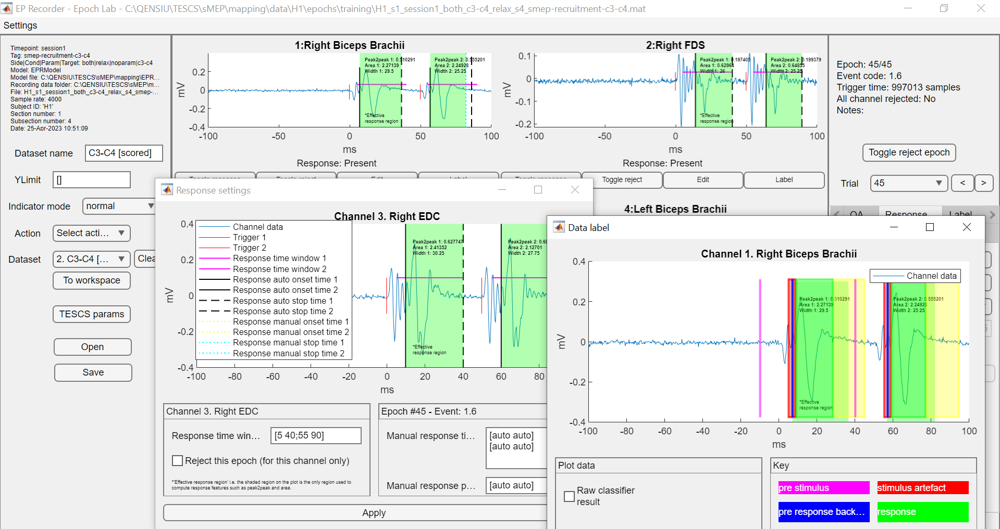

# Evoked response recorder
This package comprises different components which together allow to record,  programmatically and visually analyse evoked responses using MATLAB and Simulink.



# Table of contents
* [Evoked response recorder](#evoked-response-recorder)
* [Table of contents](#table-of-contents)
* [Getting Started](#getting-started)
* [Installation](#installation)
  * [Prerequisites](#prerequisites)
  * [Installation](#installation-1)
* [Usage](#usage)
* [License](#license)

# Getting Started
The package is designed to be used with MATLAB and Simulink.

# Features
- Visualise evoked responses as they are recorded
- Add notes to evoked responses as they are recorded
- Reject trials during data recording
- programmatically analyse evoked responses
- Visualise analyse evoked responses
- Plot response averages
- Plot recruitment curves
- Estimate Transcutaneous Electrical spinal cord stimulation (TESCS) threshold parameters
- Automatically process evoked responses
- Merge separate recordings
- Import MATLAB matrices.


# Installation
## Prerequisites
The following software is required to run the package:
* MATLAB (tested with R2022a, R2023a)
* Simulink (tested with MATLAB R2022a, R2023a)
* Signal Processing Toolbox (tested with MATLAB R2022a, R2023a)
* Statistics and Machine Learning Toolbox (tested with MATLAB R2022a, R2023a)

## Installation
The package can be installed by copying or cloning the repository. The repository can be cloned using the following command:
```bash
git clone https://github.com/BethelOsuagwu/eprecorder.git
```
Navigate to the cloned directory and add the */src* folder to MATLAB path.

# Usage
## Recording
Data recording typically done using a Simulink model. The recording parameters, including the name of the model to be used, are set in the file *initEPR.m* found in the root project directly.  Running the *initEPR.m* opens a GUI which can be used to acquire data. When a recording is started, a window appears to allow online visualisation of evoked potentials. When recording ends the data is saved in the *data* directory. The data is saved in a file with a unique name derived from recording settings. The data is saved in a *.mat* file which contains the following variables: EPR.

## Analysis
The recorded data can be proccessed visually. To do this, open the data using  *eprecorder_continuous_lab*.

Alternatively, the analysis can be done using various scripts available in the *src* directory. The scripts are typically run from the MATLAB command line. The scripts are documented in the code. 


## Typical pre-processing steps
The following are typical pre-processing steps that can be done on the data. The steps are done using the GUI. The steps can also be done programmatically using the MATLAB command line.
1. Open the dataset you want to preprocess in Continuous Lab. You can open Continuous Lab by typing `eprecorder_continuous_lab` in MATLAB prompt. Visually inspect the dataset and filter it if necessary.
2. Select the `Trigger` tab on the right side of the app and click on `Create trials`. Keep the default settings and click on `Ok`.
3. On the resulting window, click on `Open with Epoch Lab`. This will open the dataset in Epoch Lab where for each trial, each channel is plotted in a separate axis. The title of each axis indicate the channel number and name.
4. In Epoch Lab, select the `QA` tab on the right side of the app. Keep the default settings and click on `Detect noise`. This will detect and reject bad epochs. Rejected epochs are plotted in gray lines.
5. Browse through the epochs to inspect the rejection. If necessary, manually reject/unreject epochs by clicking on the `Toggle reject` buttons on each channel.
6. For each channel, click on the `Edit` button. On lower left panel of the resulting window, set the `Response time window(ms)` to the time window of interest depending on the timing of response for that channel. You can set it to [8 40]. Click on `Apply` button at the bottom of the window.
7. Select the `Response` tab on the right side of the app and select `Detection` on the subtab. Unselect the `Current epoch only` checkbox. Keep the rest of the settings as default and click on `Detect features` button. This will detect the responses in the dataset. Detected responses are indicated in the plots. Note that this step must be repeated every time a change is mage in step 6.
8. Browse through the epochs to inspect the detection. If necessary, manually set/unset the response presence for each channel and epoch by clicking on the `Toggle response` buttons on the channel. This toggle button is a three state button including *response=>1*,*no response=>0* and *auto*. The *auto* state is used to automatically set the response presence based on the detection. The actual state can be seen by clicking on the `Edit` button on the channel and inspecting the `Manual response presence` text box on the bottom right panel of the resulting window.
9. Select the `Response` tab on the right side of the app and select `Plot` on the subtab. Click on the `Average` button. Keep the default settings. Click on the `Plot average` button.
10. Select the `Response` tab on the right side of the app and select `Plot` on the subtab. Click on the `Recruitment curve` button. Keep the default settings. Click on the `Plot recruitment curve` button.


## Normalisation 
### Setting the normalisation data.
#### MVC RMS
1. Open the dataset you want to set normalisation data for in Epoch Lab  (you can open Epoch Lab by typing `eprecorder_epoch_lab` in MATLAB command prompt).
2. Select the `Response` tab on the right side of the app, and select `Norm` on the subtab.
3. Do one of the following:
	a. If you already have the RMS values: enter the RMS values for each channel in the `MVC rms` text box. Leave a channels value as NaN if it is unknown. 
	b. Otherwise: under `Update with source dataset`, select `mvc_rms` as `Type`. Click on the ` Source dataset`. Select the dataset containing the MVC data. Enter the comma/space separated Channel numbers you would like the MVC to be applied. For each channel that will be displayed, select that start and stop of valid MVC EMG. The MVC rms text box will be updated automatically accordingly.
#### Max response peak to peak
1. Open the dataset you want to set normalisation data for in Epoch Lab (you can open Epoch Lab by typing `eprecorder_epoch_lab` in MATLAB).
2. Select the `Response` tab on the right side of the app, and select `Norm` on the subtab.
3. Do one of the following:
  a. If you already have the peak to peak values: enter the peak to peak values for each channel in the `Max response peak to peak` text box. Leave a channels value as NaN if it is unknown. 
  b. Otherwise: Trigger the dataset containing the max response peak to peak data. Preprocess the dataset to reject bad epochs etc, and detect the responses and compute their feature. Save the dataset as e.g *norm1*. Afterwards, under `Update with source dataset`, select `max_response_peak2peak` as `Type`. Click on the ` Source dataset`. Select the dataset, i.e *norm1.mat*. Enter the comma/space separated Channel numbers you would like the max response peak to peak to be applied. The Max response peak to peak text box will be updated automatically accordingly.
### Applying Normalisation
To apply normalisation, e.g. MVC RMS when computing recruitment curves, use the following :
```MATLAB
rec=eprecorder_recruitment_curve();
rec.normalisationType=eprecorder_response_norm.TYPE_MVC_RMS;
```
Or for max peak to peak, e.g. peripheral nerve stimulation:
```MATLAB
rec.normalisationType=eprecorder_response_norm.TYPE_MAX_RESPONSE_PEAK2PEAK;
```

### Stimulus code to intensity conversion factor
If you wish to set a 'stimulus code to intensity conversion factor', it can be set using the GUI.
1. Open the dataset you want to set the conversion factor for in Epoch Lab (open Epoch Lab by typing `eprecorder_epoch_lab` in MATLAB).
2. Select the `Response` tab on the right side of the app, and select `Norm` on the subtab.
3. Enter the conversion factor in the `Stim. code to inten.` text box. One value should be entered per channel. But if the same value applies to all channels, only one value should be entered.

#### Reading the conversion factor
The conversion factor can be read using the following:
```MATLAB
EPR; % An epoched preprocessed dataset
stim_code_2_intens=eprecorder_metadata.get(EPR,'stim_code_to_intensity_factor').value;
```

## Average response
Using the GUI, you can plot average response.
1. Open the dataset you want to plot the average for in Epoch Lab (you can open Epoch Lab by typing `eprecorder_epoch_lab` in MATLAB command prompt).
2. Select the `Response` tab on the right side of the app, and select `Plot` on the subtab.
3. Click on the `Average` button.
4. Set parameters as needed. Selecting a specific stimulus code will plot the average for that stimulus code, etc.
5. Click on the `Plot average` button.

To compute average response programmatically, use the following:
```MATLAB
EPR; % An epoched preprocessed dataset
eprecorder_response.average(EPR);
```
This will plot the average response for the dataset.

You get the average response data using the following:
```MATLAB
[ep,t]=eprecorder_response.average(EPR);
```
Where ep is the average response and t is the time vector.


## Recruitment curve
Using the GUI, you can plot recruitment curve.
1. Open the dataset you want to plot the recruitment curve for in Epoch Lab.
2. Select the `Response` tab on the right side of the app, and select `Plot` on the subtab.
3. Click on the `Recruitment curve` button.
4. Select the feature to use for the recruitment curve. Can be 'peak2peak' or 'area', 'onset_time', 'time_width'. Default is 'peak2peak'.
6. Set other parameters as needed. Note the normalisation is currently not supported in the GUI.
5. Click on the `Plot recruitment curve` button.


To compute recruitment curve programmatically, use the following:
```MATLAB
EPR; % An epoched preprocessed dataset
rec=eprecorder_recruitment_curve();

% The feature to use for the recruitment curve can be 'peak2peak' or 'area', 'onset_time', 'time_width'. Default is 'peak2peak'
rec.feature='peak2peak';
rec.plot(EPR);
```
This will plot the recruitment curve for the dataset. 
You get the recruitment curve data using the following:
```MATLAB
EPR; % An epoched preprocessed dataset
rec=eprecorder_recruitment_curve();
[cv,err]=rec.get(EPR);
```
Where cv is the recruitment curve and err is the standard error of the mean.

## Motor threshold 
To detect the motor threshold programmatically, use the following:
```MATLAB
EPR; % An epoched preprocessed dataset
mt=eprecorder_response_motor_threshold();
EPR=mt.detectRMT(EPR);
mt_stimulus_code=eprecorder_response_motor_threshold.getRMT(EPR);% Stimulus code or intensity at the motor threshold.
```
If required, the amplitude at motor threshold can be read by either determining the amplitude average at the specific stimulus code=mt_stimulus_code. 
```MATLAB
eprecorder_response.average(EPR,[],[],mt_stimulus_code);% To plot the trace
[ep,t]=eprecorder_response.average(EPR,[],[],mt_stimulus_code);% To get the data
```

The actual amplitude can also be read from recruitment curve thus:
```MATLAB
rec=eprecorder_recruitment_curve([],mt_stimulus_code,'peak2peak');
mt_amplitude=rec.get(EPR);
```

## Merging datasets
Use the following to merge all dataset in a folder into one dataset.
```MATLAB
EPR=eprecorder_merge_epoch('C:\QENSIU\TESCS\sMEP\mapping\data\H1\epochs\training','H1_merged');
```
This leads to a dataset H1_merged.mat in the directory. 
    
    Note that EVERY dataset in the folder is included in the merge.

## Labels
    Details how to create labels will be added soon.
    
Use the following to export the labels of all dataset in a folder.
```MATLAB
eprecorder_label.exportFolder('C:\QENSIU\TESCS\sMEP\mapping\data\H23\session1\s1\epochs\training','H23')
```
This will lead to a csv file, H23.csv in the directory.

@see eprecorder_label.exportScript() for the script use to export the final training data.


# License
This project is licensed under the MIT License - see the [LICENSE](LICENSE) file for details.

